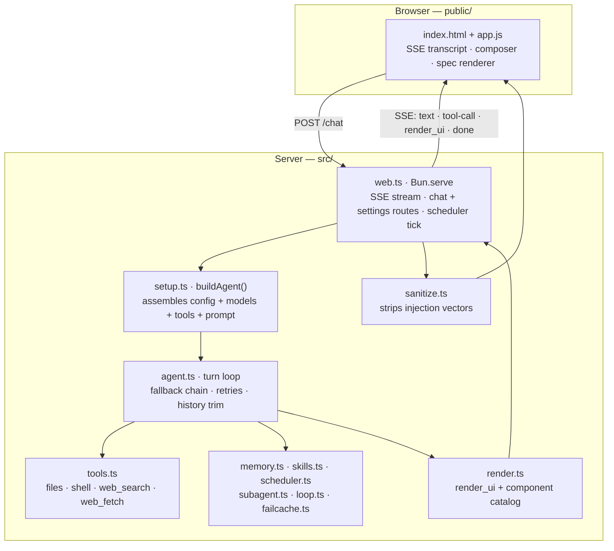
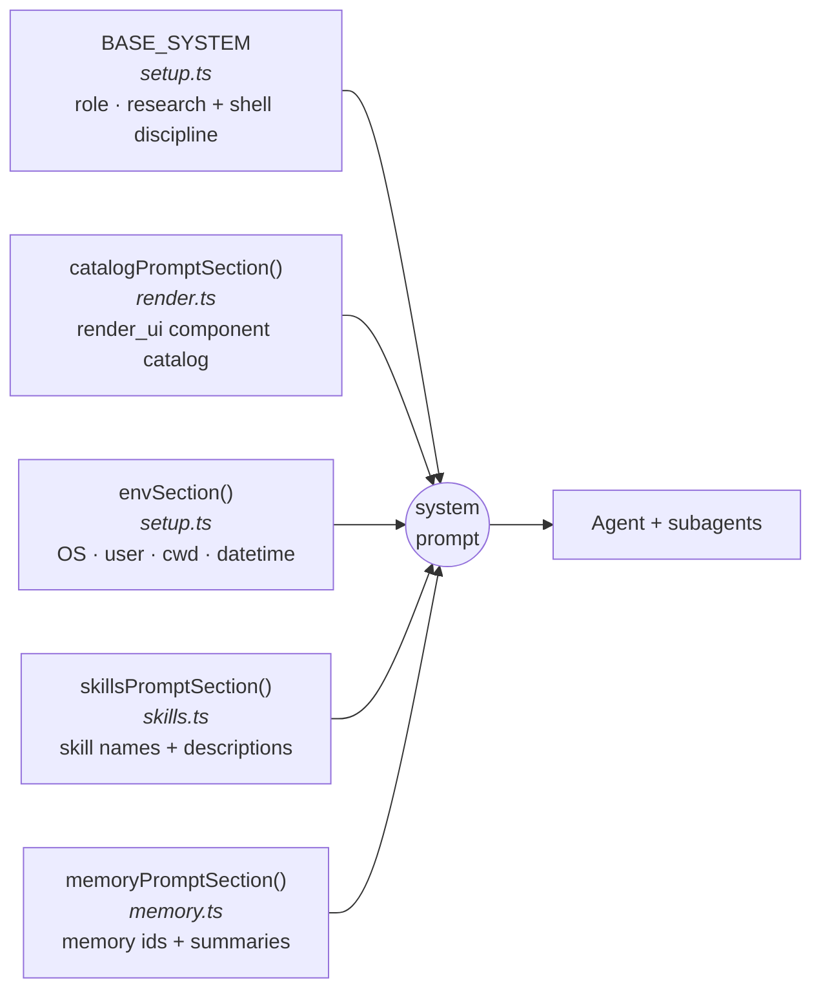
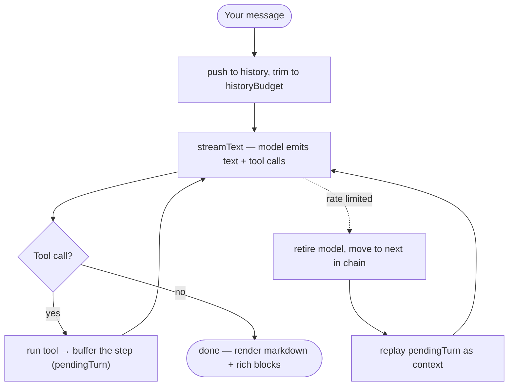

# ADHD

A small local AI assistant for everyday work — planning, writing, research, files, reminders, quick lookups. Not a coding agent.

It runs on [Bun](https://bun.sh), talks to [DeepSeek](https://deepseek.com) through the [AI SDK](https://sdk.vercel.ai), and serves a ChatGPT-style web UI on `127.0.0.1`. It reads and writes files, runs shell commands, searches and fetches the web, remembers facts, schedules tasks, and delegates work to subagents — all from a chat box, with each tool call shown live.

```
▌ you  find nearby restaurants

✓ recall       user/location
✓ web_search   places · "restaurants Homagama, Sri Lanka"
✓ web_fetch    https://…/the-one-it-picked
Here are a few near you: …
```

## Architecture

One Bun process serves the UI, streams the turn over SSE, and runs the agent in-process. No database, no framework.



## How the system prompt is built

Assembled once at startup, from five parts. The same string goes to the main agent and to every subagent.



`config.systemPrompt` replaces `BASE_SYSTEM`; the other four are always appended. Skill bodies are not included — only names and one-line descriptions, so the model knows what it can load with `use_skill`.

## The turn loop

Text and tool calls stream together. Finished steps go into a per-turn buffer, so if a model gets rate-limited mid-turn adhd switches to the next one and replays the buffer instead of re-running tools.



Guards: `maxRetries: 0` (adhd owns retries, not the SDK), `stepCountIs(12)` max tool steps per turn, and history trimmed oldest-first while keeping tool-call/result pairs intact.

## Quick start

```bash
bun install
bun start          # opens http://127.0.0.1:8787
```

Add your DeepSeek key in Settings, or put it in `.env` first. Standalone binary: `bun run build` produces `./adhd`. Run tests with `bun test`.

## What it can do

- Streams answers with live tool-call traces.
- Falls back to the next model when one is rate-limited, without losing the turn.
- Renders rich replies: images and galleries, inline video, tables, charts, metric cards, progress bars, mermaid diagrams, hand-drawn SVGs, and maps with directions ([MapTiler](https://maptiler.com) tiles, [Leaflet](https://leafletjs.com) + OSRM).
- Checks that image URLs actually serve an image before showing them or handing them to the model.
- Shows your own local files (images, video, docs) in chat, from folders you allow.
- Remembers durable facts across sessions as [OKF](https://okf.md/spec/) markdown under `~/.adhd/memory/`.
- Runs scheduled tasks while open, with desktop notifications.
- Loads skills — instruction packs the model picks up on demand.
- Delegates big self-contained subtasks to subagents, or iterates a hard task across passes with `loop_task`.
- Light, dark, and system themes.

## Tools

| Tool | What it does | Asks first |
|------|--------------|:---------:|
| `read_file` / `write_file` | Read or write a text file | — |
| `list_dir` / `grep` / `glob` | List, regex-search, or glob for files | — |
| `bash` / `powershell` | Run a shell command | yes |
| `run_script` | Write and run a Bun/TypeScript snippet | yes |
| `web_search` | Google via [Serper](https://serper.dev) — web, images, videos, places, shopping, news | — |
| `web_fetch` | Read a URL as clean markdown; `query` returns only the relevant parts | — |
| `search_files` | Find your own local images/videos/docs to show | — |
| `remember` / `recall` | Save or load durable memory | — |
| `schedule` | Add, list, or remove scheduled tasks | — |
| `use_skill` | Load a skill's full instructions | — |
| `spawn_agent` | Delegate a subtask to a subagent | — |
| `loop_task` | Iterate a task across passes | yes |
| `render_ui` | Draw a rich block — image, table, chart, map, sources | — |
| `ask_user` | Ask a multiple-choice question | interactive |

Anything that changes your machine (`bash`, `powershell`, `run_script`) asks for a yes/no in the UI first — including inside subagents and scheduled runs.

## Configuration

### Environment

Create a `.env` in the project root:

```bash
DEEPSEEK_API_KEY=sk-...   # required — the model
SERPER_API_KEY=...        # optional — enables web_search
MAPTILER_KEY=...          # optional — map tiles (falls back to OpenStreetMap)
ADHD_PORT=8787            # optional — server port, default 8787
```

`DEEPSEEK_API_KEY` and `SERPER_API_KEY` can also be set in Settings instead, which stores them in `~/.adhd/secrets.json` (`chmod 600`). Keys are never sent back to the browser. `MAPTILER_KEY` is a public client-side map key, so it does reach the browser — restrict it by domain in the MapTiler dashboard.

### config.json

Merged from `~/.adhd/config.json`, then `./.adhd/config.json` (project wins). All optional:

```jsonc
{
  "model": "deepseek-v4-flash",
  "fallbackModel": [],      // string or string[]; [] = no fallback
  "baseURL": "https://api.deepseek.com",
  "historyBudget": 60000,   // max chars of chat history per request
  "systemPrompt": "..."     // replaces BASE_SYSTEM
}
```

### Extending

Drop a file in `~/.adhd/tools/<name>.ts` that default-exports an AI SDK `tool()` — the filename becomes the tool name. Add skills as `~/.adhd/skills/<name>/SKILL.md` with `name` and `description` frontmatter.

## License

[MIT](LICENSE) © 2026 Adhishtanaka Kulasooriya
