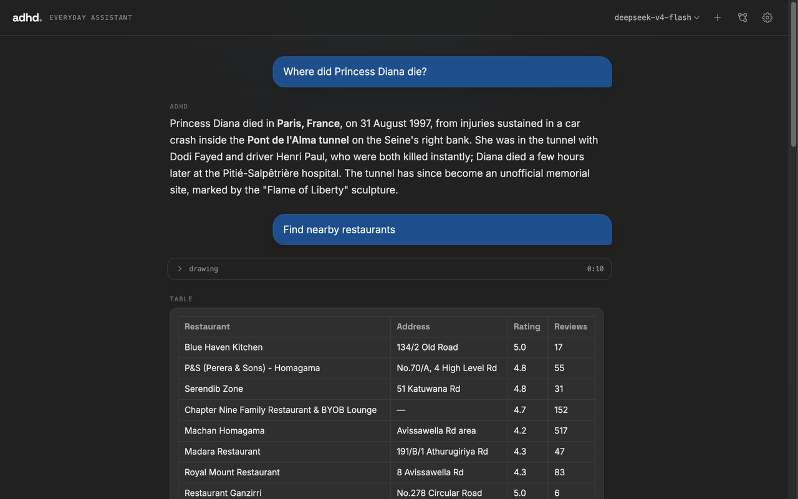
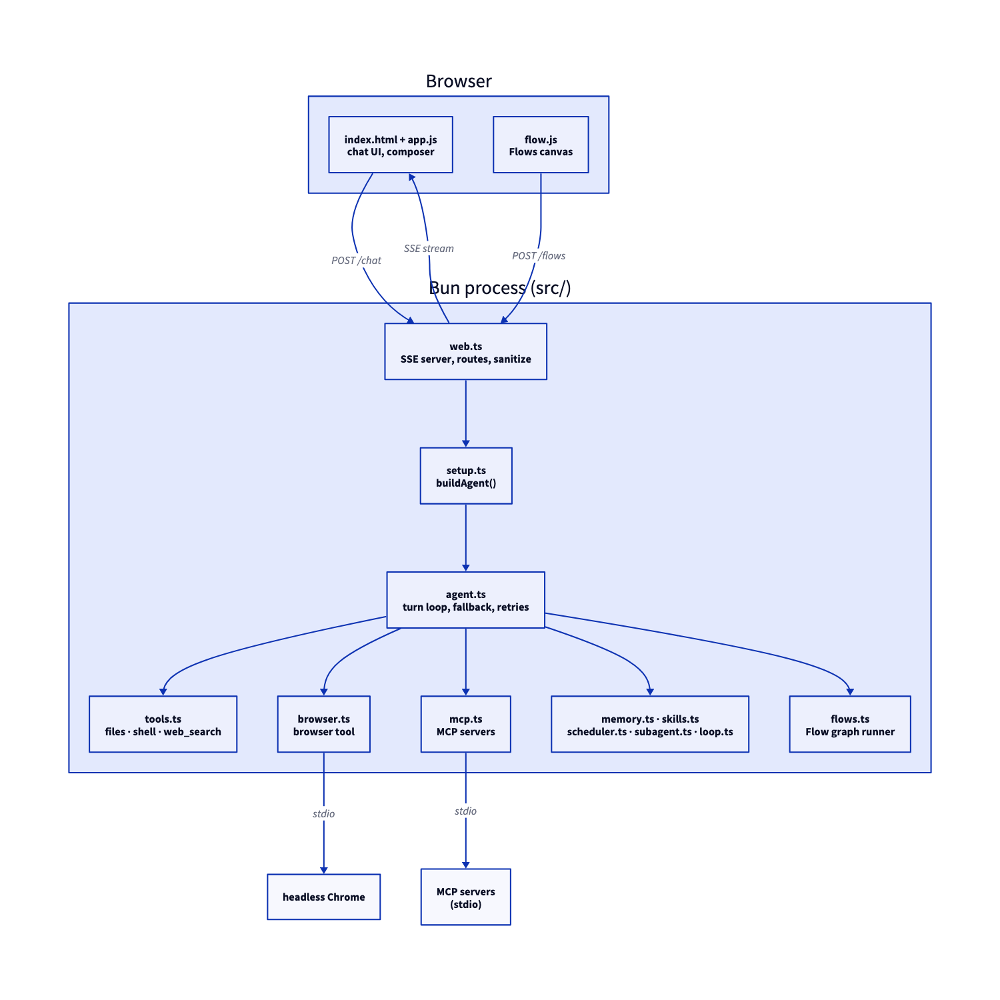

# adhd

A personal AI assistant that runs entirely on your machine — one process, no database, no cloud except the model API you point it at. From a single chat box it can read and write files, run shell commands, search and browse the web, remember things about you across sessions, schedule tasks, and automate anything you do repeatedly.

It talks to DeepSeek, Anthropic, Gemini, or any OpenAI-compatible API, and serves a ChatGPT-style UI at `http://127.0.0.1:8787`. Your API keys never leave that address.



```
▌ you  find nearby restaurants

✓ recall       user/location
✓ web_search   places · "restaurants Homagama, Sri Lanka"
✓ browser      read · https://…/the-one-it-picked
Here are a few near you: …
```

## Quick start

Requires [Bun](https://bun.sh) installed.

```bash
npm install -g adhd-cli
adhd               # opens http://127.0.0.1:8787
```

Or run it once without installing: `bunx adhd-cli`.

Add an API key in **Settings** (or put it in `.env` — see [Configuration](#configuration)) and start chatting. You only need a key for the provider you actually use.

### From source

```bash
bun install
bun start          # builds the frontend, then opens http://127.0.0.1:8787
```

- `bun run dev:web` — rebuild the frontend on save while developing.
- `bun run build` — compile a standalone `./adhd` binary.
- `bun test` — run the test suite.

## What it can do

- **Streams** answers with a live, collapsible trace of every tool call.
- **Falls back** to the next model automatically if one is rate-limited mid-turn, without losing work or re-running tools.
- **Reads and writes files**, runs shell/PowerShell commands, and searches or browses the web — each capability can be switched off independently in Settings.
- **Renders rich replies**: images and galleries, video, tables, charts, metric cards, progress bars, Mermaid diagrams, and maps with directions.
- **Shows your own local files** inline, from folders you explicitly allow.
- **Remembers** durable facts about you across sessions, as plain markdown files you can read yourself — no vector store, no embeddings.
- **Learns from repetition** — a daily pass over its own activity log drafts a memory or a reusable Flow for anything you keep doing by hand; nothing saves without your approval.
- **Schedules tasks** that fire while adhd is open, with desktop notifications.
- **Builds visual Flows** — reusable workflows you wire up once, then run from chat, on a schedule, or with a button.
- **Tracks its own progress** on multi-step tasks with a visible, ticking checklist.
- **Loads skills** — extra instructions the model pulls in only when a task needs them.
- **Delegates** large subtasks to subagents, or grinds through a hard task across several passes.
- Shows a live meter of what's filling the model's context window, and a **Compact now** button to shrink it.
- Light, dark, and system themes.

## Tools

| Tool | What it does | Asks first |
|------|--------------|:---------:|
| `read_file` / `write_file` | Read (paged, `offset`/`limit`) or write a text file | — |
| `list_dir` / `grep` / `glob` | List, regex-search, or glob for files | — |
| `bash` / `powershell` | Run a shell command | yes |
| `run_script` | Write and run a Bun/TypeScript snippet | yes |
| `web_search` | Search the web — pages, images, videos, places, shopping, news | — |
| `browser` | Drive headless Chrome: read a page as clean markdown, snapshot its elements, screenshot, fill/click/type/press, eval JS | on changes |
| `search_files` | Find your own local images/videos/docs to show | — |
| `remember` / `recall` | Save or load a durable memory | — |
| `todo_write` | Show and update a live task checklist | — |
| `schedule` | Add, list, or remove scheduled tasks | — |
| `use_skill` | Load a skill's full instructions | — |
| `spawn_agent` | Delegate a self-contained subtask to a subagent (subagents can't spawn further) | — |
| `loop_task` | Iterate a hard task across multiple passes | yes |
| `run_flow` | Run a saved Flow by name | — |
| `render_ui` | Draw a rich block — image, gallery, table, chart, map, sources | — |
| `ask_user` | Ask a multiple-choice question | interactive |

Tools from any [MCP](https://modelcontextprotocol.io) server you add appear here too, named `<server>_<tool>` — see [Extending](#extending).

Flow **tool nodes** get the same file/shell/web tools, minus `spawn_agent`/`loop_task`/`run_flow` (a Flow can't call another Flow). Flow **prompt nodes** get no tools at all.

## Flows

A **Flow** is a workflow you draw on a canvas, open from the **Flows** button — each node is a plain function, not an agent. It runs server-side and is saved to `~/.adhd/flows.json`.

| Node | What it does |
|------|--------------|
| **Start / End** | Where the run begins and stops. |
| **Prompt** | One model call, no tools — deterministic by design. |
| **If** | Asks the model a yes/no question and follows the matching branch. |
| **Switch** | Sorts the input into one of your named cases (plus an automatic `else`). |
| **Tool** | Runs exactly one tool, with fields generated from that tool's own arguments. |
| **Merge** | Waits for every incoming branch, then joins their outputs for the next node. |

Each node passes its output to the next; `{{prev}}` in a field is replaced by it, and `{{key}}` reads back any earlier node you gave that output key. Branches that fan out run in parallel; a **Merge** node fans them back in. A run can be paused, resumed, or stopped mid-flight, and a 30-step cap stops any accidental cycle.

Three ways to run one: the **Run** button, asking in chat, or scheduling it (Settings → Schedule, prompt `flow:<id>`). A few example Flows are seeded once on first launch — delete them and they stay deleted.

## Memory

Memory is a folder of plain markdown files at `~/.adhd/memory/` — one file per fact ("concept"), YAML frontmatter plus a markdown body, [OKF](https://okf.md/spec/)-shaped. No vector store, no embeddings, no approximate retrieval to trust: every system prompt gets the full list of what adhd knows (id + one-line description), and `recall` pulls one in whole when it's actually relevant. What you can open in a text editor is exactly what the model reasons over.

Every `remember`/`recall` write is also a git commit — `~/.adhd/memory/` is its own local git repo, created on first save, scoped to that folder only. A memory overwriting an old fact doesn't lose it: run `git log` / `git show` inside that folder whenever you actually need to see how something changed. Nothing diffs or surfaces automatically — the history is just there when you go looking for it.

### Reflect

Once a day (or on demand, from **Settings → Reflect**), adhd scans its own activity log for things that keep repeating — the same few tool calls in a row, or the same topic coming up across your prompts — and drafts either a memory or a reusable Flow for it. Pure frequency counting; no model call in the scan itself. Every draft sits in **Settings → Reflect** until you approve or reject it — reject one and it's never proposed again.

## Permissions

**Settings → Permissions** controls when adhd stops to ask before doing something:

- **Ask every time** — every side effect gets a confirmation card, no exceptions.
- **Normal** (default) — asks before anything that changes your machine, minus what you've already approved.
- **Approve everything** — never asks. For a sandbox you don't mind losing.

Flow tool nodes are the one exception: you built the graph and pressed Run, so they execute without asking. A confirmation nobody answers within 5 minutes is declined automatically, so a scheduled run doesn't hang waiting for a click that will never come.

## Configuration

### Environment

Create a `.env` in the project root:

```bash
DEEPSEEK_API_KEY=sk-...   # required — the model
SERPER_API_KEY=...        # optional — enables web_search
MAPTILER_KEY=...          # optional — map tiles (falls back to OpenStreetMap)
ADHD_PORT=8787             # optional — server port
```

`DEEPSEEK_API_KEY` and `SERPER_API_KEY` can also be set from **Settings**, stored in `~/.adhd/secrets.json` and never sent back to the browser.

### config.json

Merged from `~/.adhd/config.json`, then `./.adhd/config.json` (project wins). Everything is optional:

```jsonc
{
  "model": "deepseek-v4-flash",       // "<provider>:<id>"; a bare id means DeepSeek
  "fallbackModel": [],                 // string or string[], tried in order if rate-limited
  "systemPrompt": "...",               // replaces the default system prompt
  "localRoots": ["/path/..."],         // folders the file tools may touch (default: home)
  "allowedCommands": ["bash:git"],     // "always allow" list, built from the approval prompt
  "permissionMode": "normal",          // "ask" | "normal" | "auto"
  "capabilities": { "shell": false },  // switch a whole feature group off
  "disabledTools": ["run_script"],     // turn off individual tools
  "mcpServers": {                      // stdio MCP servers, loaded at startup
    "notes": { "command": "npx", "args": ["-y", "@some/notes-mcp"], "trust": "ask" }
  }
}
```

### What's stored where (`~/.adhd/`)

| Path | What |
|------|------|
| `secrets.json` | API keys |
| `config.json` | the settings above |
| `memory/` | durable memories (markdown, its own git repo — see [Memory](#memory)) |
| `schedule.json` | scheduled tasks |
| `flows.json` | saved Flows |
| `tools/<name>.ts` | your custom tools |
| `skills/<name>/SKILL.md` | your skills |

### Extending

- **Tools:** drop a file at `~/.adhd/tools/<name>.ts` that default-exports an AI SDK `tool()`. The filename becomes the tool name.
- **Skills:** add `~/.adhd/skills/<name>/SKILL.md` with `name` and `description` frontmatter; the model loads the body on demand.
- **MCP servers:** add one in **Settings → MCP servers**, or write it into `config.json` yourself. adhd connects over stdio at startup and exposes its tools as `<server>_<tool>`. Mark a read-only server `"trust": "read"` so its tools don't need approval each time — anything else asks, the same as `bash`. Remote HTTP/SSE servers aren't supported, stdio only.

## Architecture

One Bun process serves the UI over SSE and runs the agent in-process — no separate backend, no database.

- **`web/`** — the frontend (chat UI + the Flows canvas), bundled by Vite into `public/`.
- **`src/web.ts`** — the HTTP/SSE server: chat, settings, and flow routes.
- **`src/setup.ts`** — assembles config, models, tools, and the system prompt into one agent.
- **`src/agent.ts`** — the turn loop: streams text and tool calls, retries, falls back between models.
- **`src/tools.ts`**, **`src/browser.ts`** — the built-in file/shell/web tools and the headless-Chrome browser tool.
- **`src/flows.ts`** — the Flow graph runner.
- **`src/mcp.ts`** — connects to MCP servers and exposes their tools, approval-gated.
- **`src/memory.ts`**, **`src/skills.ts`**, **`src/scheduler.ts`**, **`src/subagent.ts`**, **`src/loop.ts`** — memory, skills, scheduling, subagents, and multi-pass tasks.
- **`src/reflect.ts`** — the daily pass that mines `src/toollog.ts`'s activity log for repetition and drafts memory/Flow proposals.
- **`src/sanitize.ts`** — strips injection vectors before content reaches the model or the UI.

The server only accepts loopback `Host` headers (no DNS rebinding), requires state-changing requests to be same-origin (CSRF), and serves local files only from folders you've allowed, under a locked-down CSP.



## License

[MIT](LICENSE) © 2026 Adhishtanaka Kulasooriya
