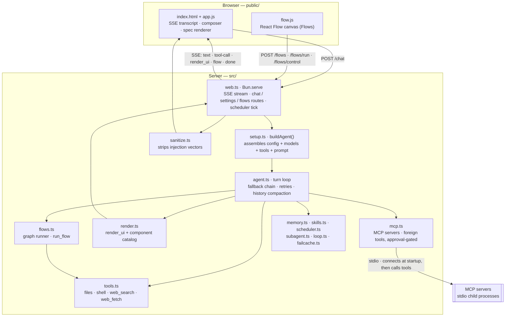
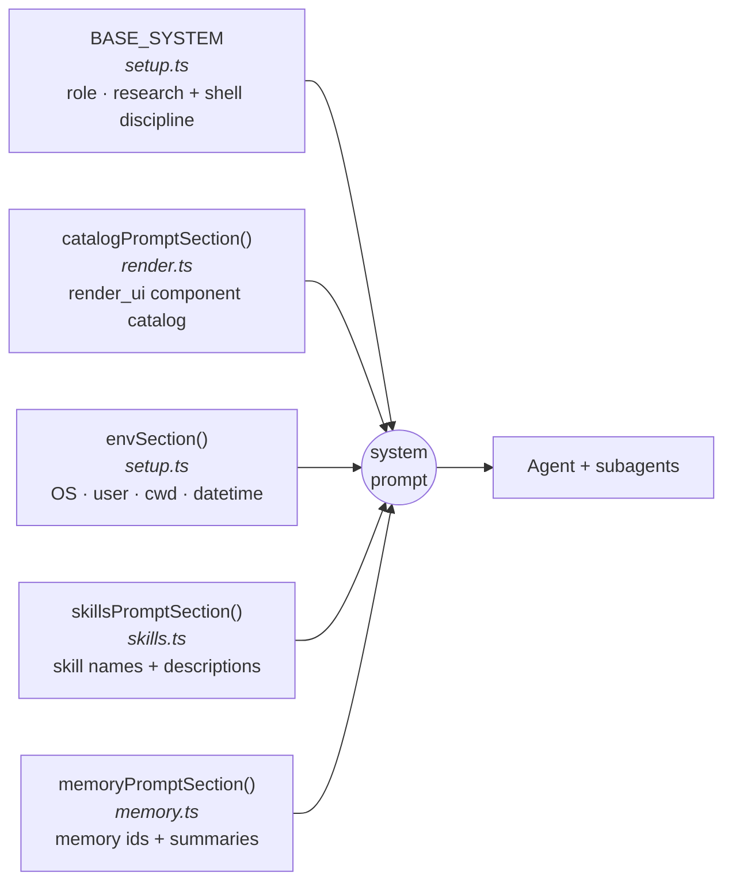
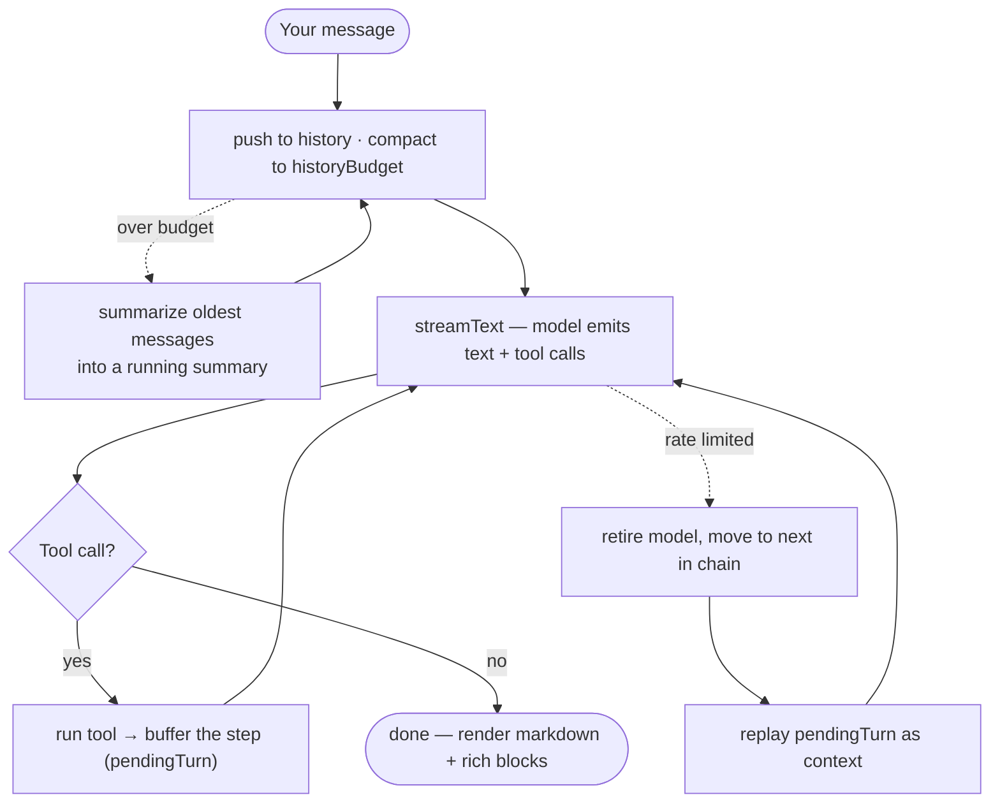
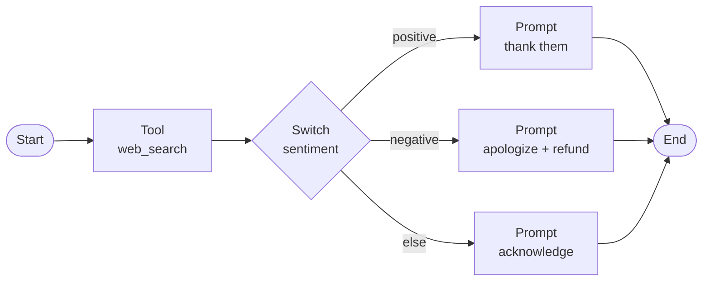
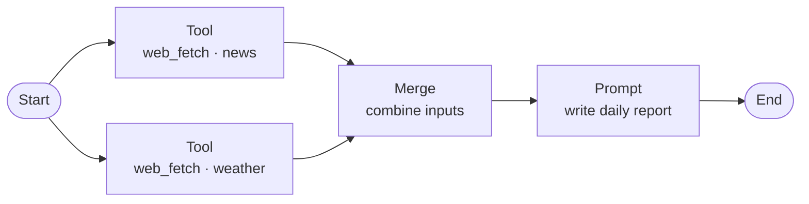

# ADHD

adhd is your own AI assistant that runs entirely on your machine. It plans, writes, researches, handles files, remembers what matters, and automates the things you do over and over, built for everyday work, not for writing code. 

It runs on Bun, talks to DeepSeek (or Anthropic, Gemini, or anything OpenAI-compatible) through the AI SDK, and serves a ChatGPT-style web UI on 127.0.0.1. From a single chat box it reads and writes files, runs shell commands, searches and fetches the web, remembers facts across sessions, schedules tasks, and delegates work to subagents, with every tool call shown live as it happens. And when a task is worth repeating, you can draw it once as a visual Flow and run it on demand, on a schedule, or by asking in chat.

```
▌ you  find nearby restaurants

✓ recall       user/location
✓ web_search   places · "restaurants Homagama, Sri Lanka"
✓ web_fetch    https://…/the-one-it-picked
Here are a few near you: …
```

Everything stays on your machine: one Bun process, no database, no framework, no cloud but the model API you point it at. API keys never leave `127.0.0.1`.

## Quick start

```bash
bun install
bun start          # serves + opens http://127.0.0.1:8787
```

Add your DeepSeek key in **Settings** (or drop it in `.env` first — see [Configuration](#configuration)), and start chatting. You only need a key for the provider you actually use. On first launch adhd seeds a few example Flows and wires up [Chrome DevTools MCP](https://github.com/ChromeDevTools/chrome-devtools-mcp) so it can drive a real browser out of the box.

- **Standalone binary:** `bun run build` compiles `./adhd` (run it from a directory that has `public/` beside it).
- **Tests:** `bun test`.

## What it can do

- **Streams** answers with a live, collapsible trace of every tool call.
- **Falls back** to the next model when one is rate-limited, mid-turn, without losing work or re-running tools.
- **Renders rich replies** — images and galleries, inline video, tables, charts, metric cards, progress bars, [Mermaid](https://mermaid.js.org) diagrams, hand-drawn SVGs, and maps with directions ([MapTiler](https://maptiler.com) tiles, [Leaflet](https://leafletjs.com) + OSRM). Image URLs are verified to actually serve an image before being shown or handed to the model.
- **Shows your own local files** (images, video, docs) inline, from folders you explicitly allow.
- **Remembers** durable facts across sessions as [OKF](https://okf.md/spec/) markdown under `~/.adhd/memory/`.
- **Schedules tasks** that fire while adhd is open, with desktop notifications.
- **Builds visual Flows** — prompt, condition, and tool steps you wire, save, run (with pause/stop), schedule, or trigger from chat. Branches run in parallel, any step can read any earlier step's output, and each step can pin its own model.
- **Shows what's filling the context** — a live strip under the composer, one segment per message coloured by kind, measured against a budget sized from the model's *real* context window (asked of the provider where it publishes one). Tool schemas are counted too, because they're usually the biggest slice.
- **Switches capabilities off** — files, shell, web, memory, skills, MCP, subagents and the rest each toggle independently, removing their tools *and* their share of the system prompt from every request. Takes effect on the next message.
- **Keeps a visible task list** — for anything multi-step, adhd writes its plan above the input and ticks items off as it goes.
- **Loads skills** — instruction packs the model picks up on demand.
- **Delegates** big self-contained subtasks to subagents, or grinds a hard task across passes with `loop_task`.
- **Light, dark, and system** themes.

### Context is the budget

Tool schemas ship on **every** request, so they dominate long before the conversation does. Measured with everything on:

| | chars per request, before you type |
|---|---|
| system prompt | ~8,700 |
| tool schemas — 50 tools, 29 of them Chrome MCP | ~27,000 |
| **fixed overhead** | **~35,700** |
| with MCP switched off (21 tools) | **~16,100** |

That's what **Settings → Capabilities** is for: each group you switch off drops its tools and its slice of the prompt. Compaction can only shrink the conversation, never this — the strip shows the fixed part separately so you can see which one is the problem.

### Permissions

**Settings → Permissions** picks when adhd stops to ask:

- **Ask every time** — every side effect gets a card, ignoring both the always-allow list and any `trust: "read"` MCP server. The card drops its "always allow" button too, so a stray click can't re-arm it.
- **Normal** (default) — asks before anything that changes your machine, minus what you've already allowed.
- **Approve everything** — never asks. For a sandbox you don't mind losing.

Anything that changes your machine (`bash`, `powershell`, `run_script`) asks for a yes/no in the UI first — including inside subagents, Flows, and scheduled runs. Approving with "always allow" remembers that *program* (`bash:git`), never a whole command line, and is offered only for a single plain command — anything that could smuggle a second one (`ls && rm -rf ~`) is one-time approval only. A prompt nobody answers within 5 minutes declines itself, so a scheduled run that fires while you're away fails safely instead of hanging.

## Architecture

One Bun process serves the UI, streams each turn over SSE, and runs the agent in-process.



Guards on the loopback server: only loopback `Host` headers are accepted (DNS-rebinding), state-changing requests must be same-origin (CSRF), and local files are served only from allowed roots with a locked-down CSP.

## How the system prompt is built

Assembled once at startup, from five parts. The same string goes to the main agent and to every subagent.



`config.systemPrompt` replaces `BASE_SYSTEM`; the other four are always appended. Skill and memory *bodies* aren't included — only names and one-line descriptions, so the model knows what it can pull in with `use_skill` and `recall`.

## The turn loop

Text and tool calls stream together. Finished steps go into a per-turn buffer, so if a model gets rate-limited mid-turn adhd switches to the next one in the chain and replays the buffer instead of re-running tools.



Guards: `maxRetries: 0` (adhd owns retries, not the SDK), `stepCountIs(12)` max tool steps per turn, and history that's **compacted, not dropped** — when it outgrows `historyBudget` the oldest messages are summarized into a running summary (folded into the system prompt) instead of being discarded, so the model keeps the gist of the earlier conversation. Tool-call/result pairs stay intact either way.

`historyBudget` sizes itself to the model rather than being a fixed number: adhd asks the provider how big the context window is (Anthropic and Google publish it; DeepSeek doesn't, so a table covers it) and budgets a quarter of it, capped at 400k chars ≈ 100k tokens. History is re-sent every turn, so "fill the window" is a bill, not a free win — the cap is the point. Set `historyBudget` explicitly to override. The strip above the composer shows the result live, and **Compact now** squeezes the thread without clearing it.

Long tool calls don't hold the turn open: a tool that blows its deadline hands back a "backgrounded" note so the UI goes idle and you can keep chatting. When the work lands, its result wakes the agent as a fresh turn — and several jobs finishing close together are coalesced into a single turn, so a burst of backgrounded fetches produces one reply, not one per job.

## Flows

A **Flow** is a saved workflow you draw on a canvas — [n8n](https://n8n.io)-style, but each node is a plain function, not an agent. Open it from the **Flows** button in the header.

The canvas is [React Flow](https://reactflow.dev), loaded from a pinned CDN via an import map — no build step, in keeping with the rest of the frontend. The graph runs **server-side** in [`flows.ts`](src/flows.ts) and is stored as JSON in `~/.adhd/flows.json`.

Data flows along the edges: each node takes the previous node's output as its input and passes its own output on. `{{prev}}` anywhere in a field is replaced by that input. Without a placeholder, the input is appended (for prompt/if/switch text) or left untouched (for tool arguments).

Every node's output is also kept for the whole run, so a later step can read one that isn't next to it. Give a node an **output key** and any field downstream can use `{{thatKey}}` — a reviewer node can quote the research node three steps back. Unset, the key is the node's own id. An unknown `{{name}}` is left as-is rather than blanked, so writing a template to a file still works.

Branches that split apart **run at the same time**: one superstep runs everything currently ready, then applies the results in order. A three-way fan-out costs about as long as its slowest branch, not the sum. The trade is that a branch can't read its own siblings — `{{key}}` only sees steps that finished before this one — and last-write-wins on a shared key is resolved by position in the graph, not by whichever model replied first.

Prompt, condition, and switch nodes can each **pin their own model** (`anthropic:claude-sonnet-5` for the reviewer, something cheap for a switch). Leave it on *flow default* and the node follows whatever model the app is set to; pin it and it stays put.



| Node | What it does |
|------|--------------|
| **Start / End** | Mark where the run begins and where it stops. Start is the explicit entry point; End halts the walk. |
| **Prompt** | One model call, **no tools** — deterministic by design, so a step can't wander off doing its own research. Optional *Use saved memory* toggle folds in what adhd knows about you (off by default). |
| **If** | Asks the model a yes/no question about the input and follows the matching edge. |
| **Switch** | Multi-way branch: the model sorts the input into one of your named cases (plus an automatic `else`) and follows that case's edge. Each case is its own output handle. |
| **Tool** | Runs exactly one tool. Argument fields are read straight from the tool's own schema — required fields marked, defaults applied, enums become dropdowns. Shell tools still ask for approval. |
| **Merge** | Fan-in: wire several nodes into it and it **waits for all of them**, then joins their outputs into labeled sections (`## 1`, `## 2`, …) for the next node — usually a Prompt. The counterpart to fan-out, where one node feeds several. |

A node with several outgoing edges **fans out** — every branch runs — and a **Merge** node fans them back in. This is what a "combine a few tool outputs, then write one report" flow looks like:



Runs stream over the same SSE channel as chat: each node lights up, reports its duration, and logs its output. A run can be **paused, resumed, or stopped** mid-flight. A built-in 30-step cap stops any accidental cycle instead of hanging.

**Three ways to run a Flow:**

- The **Run** button on the canvas.
- Ask in chat — the agent calls the `run_flow` tool by name.
- Schedule it — add a task whose prompt is `flow:<id>` (Settings → Schedule).

Example Flows (Morning brief, Umbrella check, File → todo list) are seeded **once**, on first run only. Delete them and they stay deleted; your own Flows are never touched. The Chrome MCP server is seeded the same way.

Chrome ships trusted (`"trust": "read"`), so its tools run without an approval card — otherwise ~29 tools would each prompt. That's the deliberate trade: a page adhd just fetched could steer the browser without asking. Set it to `"ask"` in **Settings → MCP servers**, or set Permissions to *Ask every time*, which overrides every server's trust.

Expanding a server in **Settings → MCP servers** lists the tools it actually offers, each with its own switch — useful when you want a server's read tools but not the ones that click things. Individual switches apply on the next message; adding or removing a whole server still needs a restart.

## Tools

| Tool | What it does | Asks first |
|------|--------------|:---------:|
| `read_file` / `write_file` | Read or write a text file | — |
| `list_dir` / `grep` / `glob` | List, regex-search, or glob for files | — |
| `bash` / `powershell` | Run a shell command | yes |
| `run_script` | Write and run a Bun/TypeScript snippet | yes |
| `web_search` | Google via [Serper](https://serper.dev) — web, images, videos, places, shopping, news | — |
| `web_fetch` | Read a URL as clean markdown; `query` returns only the relevant parts | — |
| `search_files` | Find your own local images/videos/docs to show | — |
| `remember` / `recall` | Save or load durable memory | — |
| `schedule` | Add, list, or remove scheduled tasks | — |
| `use_skill` | Load a skill's full instructions | — |
| `spawn_agent` | Delegate a self-contained subtask to a subagent (depth 1 — subagents can't spawn) | — |
| `loop_task` | Iterate a hard task across multiple passes | yes |
| `run_flow` | Run a saved Flow by name | — |
| `render_ui` | Draw a rich block — image, gallery, table, chart, map, sources | — |
| `ask_user` | Ask a multiple-choice question | interactive |

Flow **tool nodes** get the same file/shell/web tools (minus `spawn_agent` / `loop_task` / `run_flow`, so a Flow can't recurse into another). Flow **prompt nodes** get no tools at all.

Tools from [MCP](https://modelcontextprotocol.io) servers join this list at startup as `<server>_<tool>` — see [Extending](#extending).

## Configuration

### Environment

Create a `.env` in the project root:

```bash
DEEPSEEK_API_KEY=sk-...   # required — the model
SERPER_API_KEY=...        # optional — enables web_search
MAPTILER_KEY=...          # optional — map tiles (falls back to OpenStreetMap)
ADHD_PORT=8787            # optional — server port, default 8787
```

`DEEPSEEK_API_KEY` and `SERPER_API_KEY` can instead be set in **Settings**, which stores them in `~/.adhd/secrets.json` (`chmod 600`). These keys are never sent back to the browser. `MAPTILER_KEY` is a public client-side map key, so it *does* reach the browser — restrict it by domain in the MapTiler dashboard.

### config.json

Merged from `~/.adhd/config.json`, then `./.adhd/config.json` (project wins). All optional:

```jsonc
{
  "model": "deepseek-v4-flash",  // "<provider>:<id>"; a bare id means DeepSeek
                                 // anthropic: · google: · custom: · deepseek:
  "fallbackModel": [],           // string or string[]; [] = no fallback. May mix providers
  "baseURL": "https://api.deepseek.com",
  "customBaseURL": "https://openrouter.ai/api/v1", // the "custom:" provider's endpoint
  // "historyBudget": 60000,     // omit to auto-size from the model's real context window
  "systemPrompt": "...",         // replaces BASE_SYSTEM
  "localRoots": ["/path/..."],   // folders the local-file tools may read (default: home)
  "allowedCommands": ["bash:git"],// "always allow" keys added via the approval prompt
  "permissionMode": "normal",    // "ask" | "normal" | "auto" (Settings → Permissions)
  "capabilities": { "shell": false }, // switch feature groups off; unlisted = on
  "disabledTools": ["chrome_click"],  // individual tools, MCP ones included
  "mcpServers": {                // stdio MCP servers; their tools load at startup
    "notes": { "command": "npx", "args": ["-y", "@some/notes-mcp"], "trust": "ask" }
  }
}
```

### State on disk (`~/.adhd/`)

| Path | What |
|------|------|
| `secrets.json` | API keys (`chmod 600`) |
| `config.json` | the settings above |
| `memory/` | durable memories, one OKF markdown file each |
| `schedule.json` | scheduled tasks |
| `flows.json` | saved Flows |
| `tools/<name>.ts` | your custom tools |
| `skills/<name>/SKILL.md` | your skills |

### Extending

- **Tools:** drop `~/.adhd/tools/<name>.ts` that default-exports an AI SDK `tool()` — the filename becomes the tool name, and it's available in chat and as a Flow tool node.
- **Skills:** add `~/.adhd/skills/<name>/SKILL.md` with `name` and `description` frontmatter; the model loads the body on demand with `use_skill`.
- **MCP servers:** add one in **Settings → MCP servers** (name, command, arguments, and a read-only tick), or write the `mcpServers` entry in `config.json` yourself. adhd launches each one over stdio at startup, lists its tools, and exposes them as `<server>_<tool>` (`notes_search`) — so anything with an MCP server works without adhd shipping a connector for it. Servers added in Settings load on the next start.

  Because those tools arrive with schemas adhd didn't write and side effects it can't infer from a name, **every MCP call asks for approval by default** — the same prompt `bash` gets, showing the tool name and its arguments. Set `"trust": "read"` on a server that only reads (a docs lookup, a search index) to let its tools run unprompted. A server that fails to start is logged and skipped; it never blocks startup.

  stdio only — local processes are the local-first case and need no OAuth. Remote HTTP/SSE servers aren't supported.

## License

[MIT](LICENSE) © 2026 Adhishtanaka Kulasooriya
